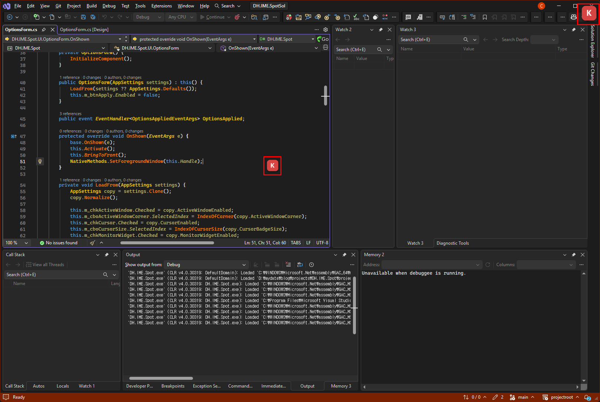
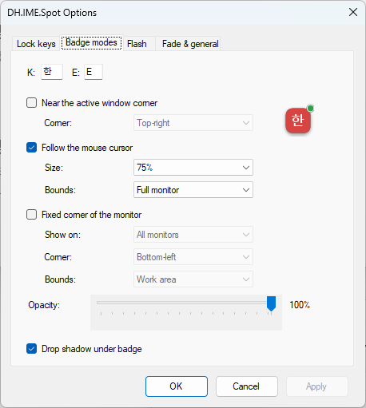

# DH.IME.Spot

*[한국어](README.md) | English*

A lightweight Windows tray utility that shows the current **Korean / English IME state**
as a small badge near your mouse cursor, the active window, and/or each monitor —
so you always know which language you are about to type on a multi-monitor desktop.



- **Version:** 1.0.0.2
- **Platform:** Windows 10 or later (x86/x64)
- **Runtime:** .NET Framework 4.6 (ships with Windows 10+)
- **Dependencies:** none (no NuGet packages)

## Features

- **IME state badge** — a per-pixel alpha layered badge shows user-configurable `Hangul glyph` / `Latin glyph`.
- **Three placement modes, independently toggleable:**
  - *Active window corner* — badge pinned to a corner of the focused window.
  - *Cursor companion* — badge follows the mouse cursor (smooth 60 Hz tracking, no global mouse hook, with `Work area` / `Full monitor` bounds selection).
  - *Per-monitor widget* — a fixed badge in a chosen corner of the current monitor or all monitors, with `Work area` / `Full monitor` bounds selection.
- **Two lock-indicator channels**
  - `LockPill` — a small row of colored dots under the glyph
  - `Track corner badge` — lock dots attached to the badge corners
- **Per-lock options** — independent `Caps/Num/Scroll` tracking, corner, dot size, and dot color.
- **Default badge opacity is 100 %** — glyph and shadow alpha scale with the background.
- **Cursor badge size** option (25 %–150 %).
- **Per-monitor DPI aware.**
- **Full-screen aware** — badges hide automatically over exclusive / borderless full-screen apps.
- **Run at startup** toggle.
- **Pause overlay** from the tray menu (runtime only, not persisted).
- tray icon **double click -> Options**.
- Settings are stored in the **registry** — no config files are written.

## Install / Run

1. Build (see below) or grab `DH.IME.Spot.exe` from a release.
2. Run `DH.IME.Spot.exe`. It appears in the notification area (system tray).
3. Right-click or double-click the tray icon → **Options…** to configure placement, lock options, glyphs, opacity, size, and startup.
4. Right-click → **Exit** to quit.

The application is a single self-contained `.exe` (~53 KB). No installer, no admin rights.

### If Windows blocks the downloaded file

The release zip is downloaded from the internet, so Windows tags it with the
Mark of the Web. Extracting propagates that tag to the `.exe`, and SmartScreen
may block it from running. This is expected for an unsigned personal utility.

The cleanest fix is to unblock the zip **before** extracting:

1. Right-click the downloaded `DH.IME.Spot-vX.X.X.X.zip` → **Properties**
2. Tick **Unblock** at the bottom → **OK**
3. Then extract.

If you already extracted, do the same on the `.exe`, or run in PowerShell:

```powershell
Get-ChildItem -Recurse | Unblock-File
```

If the blue SmartScreen dialog appears, choose **More info → Run anyway**.



## Build

Requires Visual Studio 2022 (or MSBuild) with the .NET Framework 4.6 targeting pack.

```
MSBuild DH.IME.SpotSol\workspace\DH.IME.Spot\DH.IME.Spot.csproj /t:Rebuild /p:Configuration=Release
```

Output: `DH.IME.SpotSol\output\Release\DH.IME.Spot.exe`

Solution file: `DH.IME.SpotSol\DH.IME.SpotSol.slnx` (VS2022 `.slnx` format).
The project is a classic (non-SDK) `.csproj`, C# 7.3, `WinExe`.

## How it works

- IME state is read from the focused window's default IME window
  (`ImmGetDefaultIMEWnd` + `WM_IME_CONTROL` / `IMC_GETCONVERSIONMODE`, `IME_CMODE_NATIVE` bit).
- Focus changes are tracked with narrow single-event `SetWinEventHook` registrations
  (`EVENT_SYSTEM_FOREGROUND`, `EVENT_OBJECT_FOCUS`) plus a short polling fallback for the
  Han/Yeong toggle (which fires no window event).
- Badges are drawn on borderless `WS_EX_LAYERED` windows updated via `UpdateLayeredWindow`.

## Settings (registry)

Settings key: `HKEY_CURRENT_USER\SOFTWARE\DHTOOL\DH.IME.Spot`

| Value | Type | Meaning |
|---|---|---|
| `BackgroundAlpha` | DWORD | Badge background alpha, 26–255 (≈10 %–100 %) |
| `ActiveWindowEnabled` | DWORD | Active-window-corner badge on/off |
| `ActiveWindowCorner` | REG_SZ | `TopLeft` / `TopRight` / `BottomLeft` / `BottomRight` |
| `CursorEnabled` | DWORD | Cursor-companion badge on/off |
| `CursorBadgeSize` | REG_SZ | `Scale25` … `Scale150` |
| `CursorBoundsMode` | REG_SZ | `WorkArea` / `MonitorArea` |
| `MonitorWidgetEnabled` | DWORD | Per-monitor widget badge on/off |
| `MonitorWidgetCorner` | REG_SZ | Corner for the per-monitor widget |
| `MonitorWidgetScope` | REG_SZ | `CurrentMonitor` / `AllMonitors` |
| `MonitorWidgetBoundsMode` | REG_SZ | `WorkArea` / `MonitorArea` |
| `BadgeLockPill` | DWORD | Shows the under-glyph `LockPill` |
| `ShowCapsLock` / `ShowNumLock` / `ShowScrollLock` | DWORD | Per-lock tracking on/off |
| `CapsLockCorner` / `NumLockCorner` / `ScrollLockCorner` | REG_SZ | Corner for each lock dot |
| `CapsLockDotSize` / `NumLockDotSize` / `ScrollLockDotSize` | DWORD | Size of each lock dot |
| `CapsLockDotColor` / `NumLockDotColor` / `ScrollLockDotColor` | REG_SZ | Color of each lock dot |
| `HangulGlyph` / `LatinGlyph` | REG_SZ | Custom glyphs used by the badge and flash |
| `FlashEnabled` and other `Flash*` values | DWORD / REG_SZ | Change-flash options |
| `FadeIdleEnabled` and other `Fade*` values | DWORD / REG_SZ | Idle-fade options |
| `PollIntervalMs` | DWORD | IME polling interval |

Run-at-startup is stored separately as value `DH.IME.Spot` under
`HKEY_CURRENT_USER\SOFTWARE\Microsoft\Windows\CurrentVersion\Run`.

### Full uninstall

Delete `DH.IME.Spot.exe`, then remove:

```
HKCU\SOFTWARE\DHTOOL\DH.IME.Spot
HKCU\SOFTWARE\Microsoft\Windows\CurrentVersion\Run  ->  value "DH.IME.Spot"
```

## License

[MIT](LICENSE) © 2026 CYBERKDH
